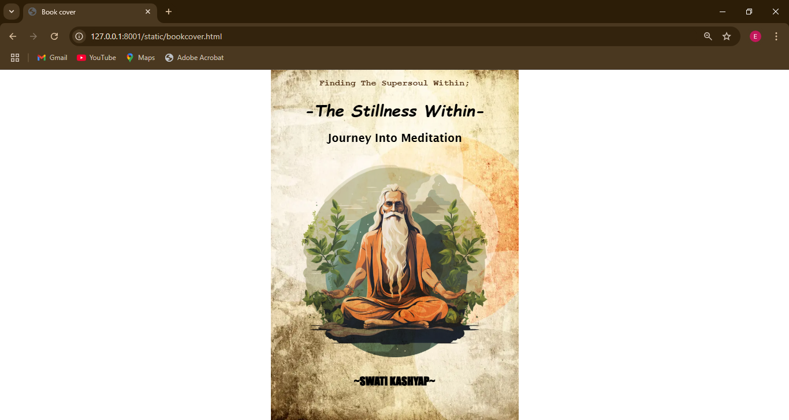

# Ex.06 Book Front Cover Page Design
# Date:18-10-2024
# AIM:
To design a book front cover page using HTML and CSS.

# DESIGN STEPS:
## Step 1:
Create a Django Admin project.

## Step 2:
Create an app in the Django interface.

## Step 3:
Create a folder named 'static' in the app folder.

## Step 4:
Create a new HTML file in the static folder.

## Step 5:
Write the HTML code with relevant CSS properties.

## Step 6:
Choose the appropriate style and color scheme.

## Step 7:
Insert the images in their appropriate places.

## Step 8:
Publish the website in the LocalHost.

# PROGRAM:
```
bookcover.html

<!DOCTYPE html>
<html lang="en">
<head>
<meta charset="UTF-8">
<meta name="viewport" content="width=device-width, initial-scale=1.0">
<title>Book cover</title> 
<style>
    .img_deg{
        mix-blend-mode: multiply;
       
    }
    h3{
        color:rgba(73, 41, 11, 0.986);
        position:relative;
        font-family: 'Courier New', Courier, monospace;
    }
    
</style> 

</head>
<body background="backgrounds-book-cover-creative-space-name-35971871.webp"  style="background-repeat: no-repeat; background-attachment:fixed;background-size: contain;background-position: center;">

    <h3 style="text-align:center;">Finding The Supersoul Within;</h3>
    
    <h1 style="font-family:cursive; font-style: italic;text-align: center;font-size:35px">-The Stillness Within-</h1>
    <h2 style="text-align:center;font-family:'Lucida Sans', 'Lucida Sans Regular', 'Lucida Grande', 'Lucida Sans Unicode', Geneva, Verdana, sans-serif">Journey Into Meditation</h2>
    
    
    
    <h2 style="text-align:center;font-family:fantasy">~SWATI KASHYAP~</h2>
</body>
</html>

```
# OUTPUT:



# RESULT:
The program for designing book front cover page using HTML and CSS is completed successfully.
